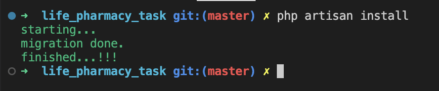
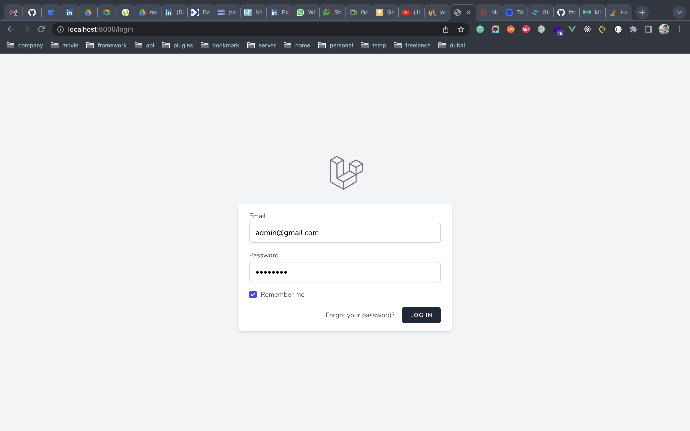
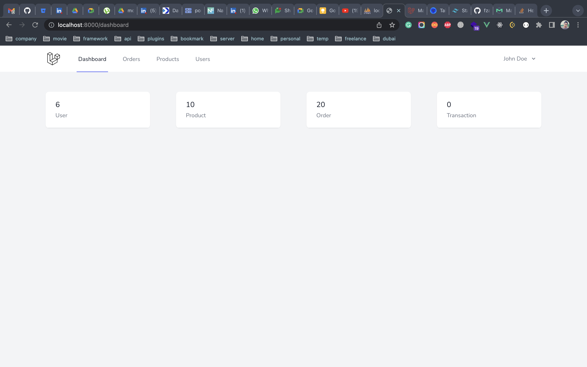
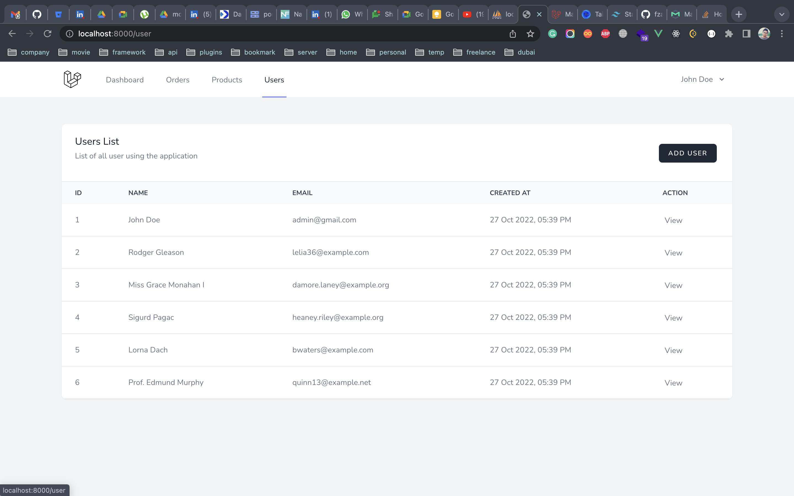
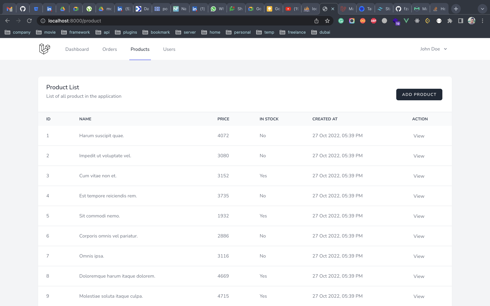
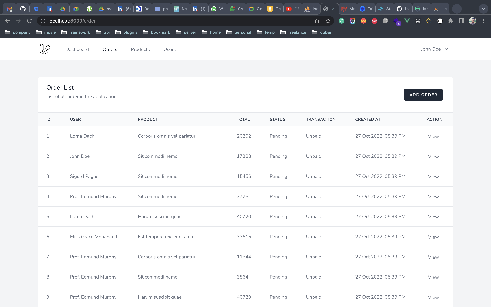
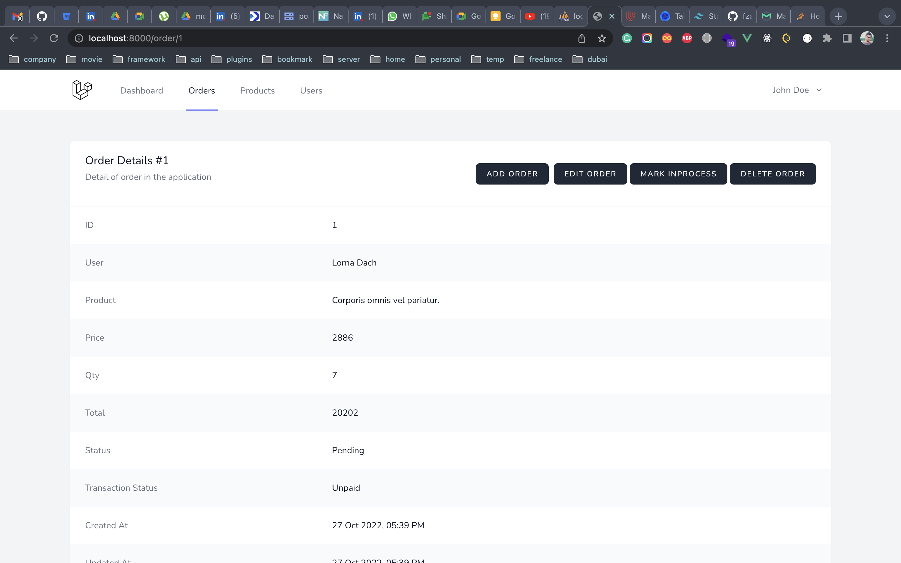
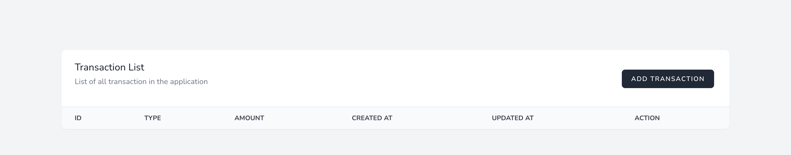

# Life Pharmacy Task

## Problem Statement

Create a Laravel App with following specifications & features:

-   CRUDs: Users, Products, Orders, & Transactions
-   Methodology: Follow SOLID principles
-   DB: Use any DB (preferably mysql or pgsql) and create appropriate migrations & seeders
-   APIs: List Products, Fetch Single Product, Create Order, List Orders, Fetch Single Order by ID with transactions lazy-loaded into it, Delete Single Order by ID
-   Events & Notifications: Email notifications On OrderCreation, TransactionStatusUpdate, WelcomeEmail on UserSignup events
-   Frontend: Build using inertiajs + jetstream. You can use any CSS Framework (like bootstrap, tailwind, or materialize).
-   Relations: Orders will belong to User, Orders will have Transactions, Orders will have products, & Transactions will belong to Orders & Users.

## Technologies

-   Frontend: Inertia, Vue.js, Tailwind CSS
-   Backend: PHP (7.4), Laravel (8.7)
-   Database: Mysql
-   Server: XAMPP
-   Mail Client: Mailtrap

## Demo

[Youtube Link](https://youtu.be/cvJ-3Zy1Uvc)

## Installation Process

> Pull code from github

```sh
git clone https://github.com/nfraz007/life_pharmacy_task.git
cd life_pharmacy_task
```

> open this repo to any code editor

> create a new database `life_pharmacy_task` and put the credential in `.env` file. if you have mailtrap credential then add them as well

```sh
composer install
php artisan install
```

> If the database credential is correct you should run migration and seeder file



> Login
> 

> Dashboard
> 

> User List
> 

> Product
> 

> Order List
> 

> Order Detail
> 
